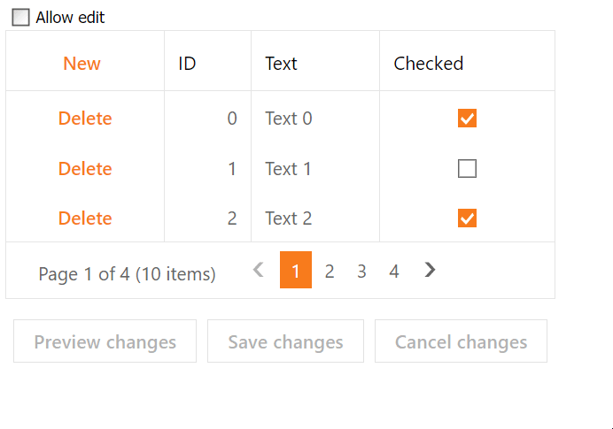

# Grid View for ASP.NET Web Forms - How to enable or disable the cell edit functionality in batch mode based on a condition
<!-- run online -->
**[[Run Online]](https://codecentral.devexpress.com/t150957/)**
<!-- run online end -->

This example demonstrates how to use the check box state to enable or disable the grid's cell edit functionality in batch edit mode.



## Overview

Follow the steps below:

1. Create the [Grid View](https://docs.devexpress.devx/AspNet/DevExpress.Web.ASPxGridView) control and populate it with columns. Set the grid's [SettingsEditing.Mode](https://docs.devexpress.devx/AspNet/DevExpress.Web.ASPxGridViewEditingSettings.Mode) property to `Batch` to enable the batch edit mode. Add a [GridViewCommandColumn](https://docs.devexpress.devx/AspNet/DevExpress.Web.GridViewCommandColumn) and set its [ShowNewButtonInHeader](https://docs.devexpress.devx/AspNet/DevExpress.Web.GridViewCommandColumn.ShowNewButtonInHeader) and [ShowDeleteButton](https://docs.devexpress.devx/AspNet/DevExpress.Web.GridViewCommandColumn.ShowDeleteButton) properties to `true`.

    ```aspx
    <dx:ASPxGridView ID="ASPxGridView1" runat="server" KeyFieldName="ID" ...>
        <SettingsEditing Mode="Batch" />
        <Columns>
            <dx:GridViewCommandColumn ShowNewButtonInHeader="true" ShowDeleteButton="true" />
            <!-- ... -->
        </Columns>
    </dx:ASPxGridView>
    ```

2. Add a check box and handle its client-side [CheckedChanged](https://docs.devexpress.devx/AspNet/DevExpress.Web.ASPxCheckBox.CheckedChanged) event. In the handler, create a flag variable, get the current state of the check box, and assign the state to the flag variable.

    ```aspx
    <dx:ASPxCheckBox ID="ASPxCheckBox1" runat="server" Text="Allow edit">
        <ClientSideEvents CheckedChanged="OnAllowEditChanged" />
    </dx:ASPxCheckBox>
    ```

    ```js
    var allowEdit = false;
    function OnAllowEditChanged(s, e) {
        allowEdit = s.GetValue();
    }
    ```

3. Handle the grid's client-side [BatchEditStartEditing](https://docs.devexpress.devx/AspNet/js-ASPxClientGridView.BatchEditStartEditing), [BatchEditRowInserting](https://docs.devexpress.devx/AspNet/js-ASPxClientGridView.BatchEditRowInserting), and [BatchEditRowDeleting](https://docs.devexpress.devx/AspNet/js-ASPxClientGridView.BatchEditRowDeleting) events. In the handler, cancel the current edit operation based on the flag variable value.

    ```aspx
    <dx:ASPxGridView ID="ASPxGridView1" runat="server"  ...>
        <!-- ... -->
        <ClientSideEvents BatchEditStartEditing="OnEditing" BatchEditRowDeleting="OnEditing" BatchEditRowInserting="OnEditing" />
    </dx:ASPxGridView>
    ```

    ```js
    function OnEditing(s, e) {
        e.cancel = !allowEdit;
    }
    ```

## Files to Review

* [Default.aspx](./CS/Default.aspx) (VB: [Default.aspx](./VB/Default.aspx))

## Documentation

* [Grid in Batch Edit Mode](https://docs.devexpress.com/AspNet/16443/components/grid-view/concepts/edit-data/batch-edit-mode)

## More Examples

* [Grid View for ASP.NET MVC - How to control data editing on the client side in batch edit mode](https://github.com/DevExpress-Examples/gridview-how-to-conditionally-enable-and-disable-the-batch-editing-on-the-client-side-t150965)
